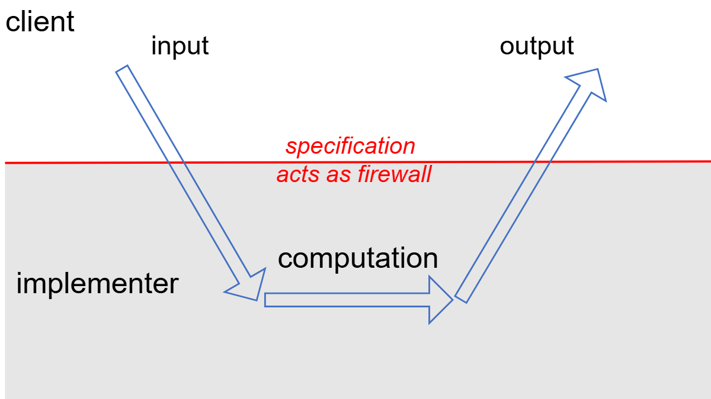
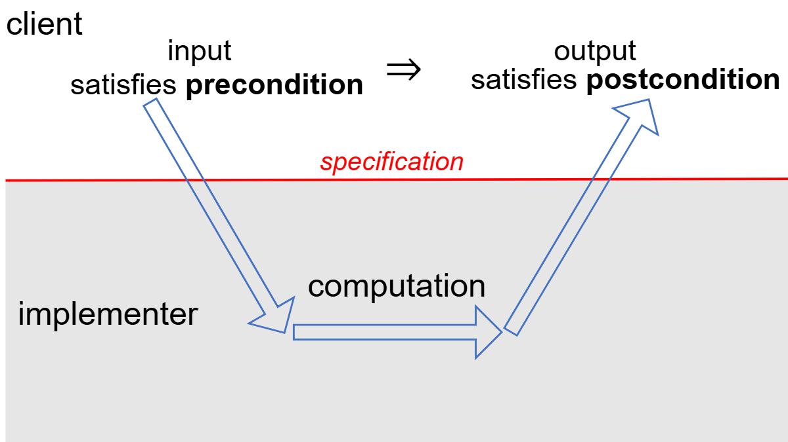
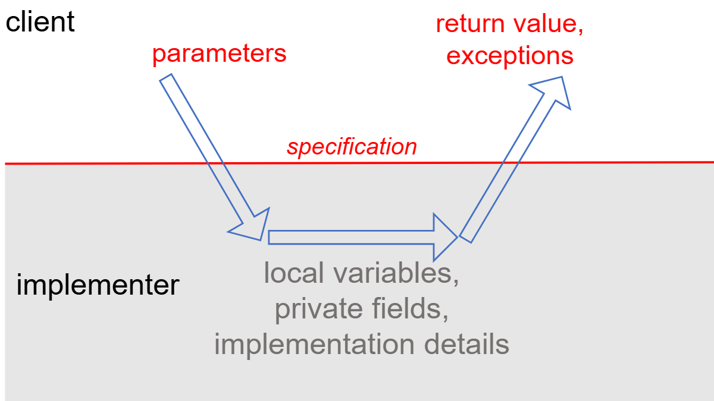
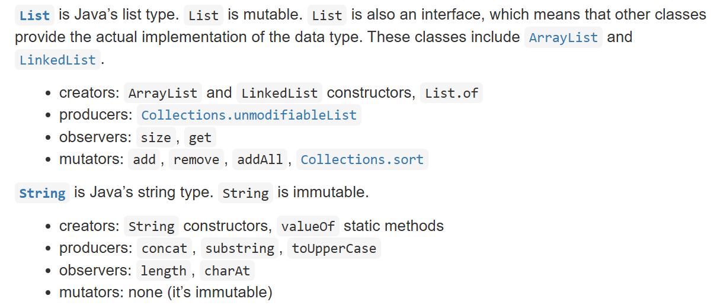
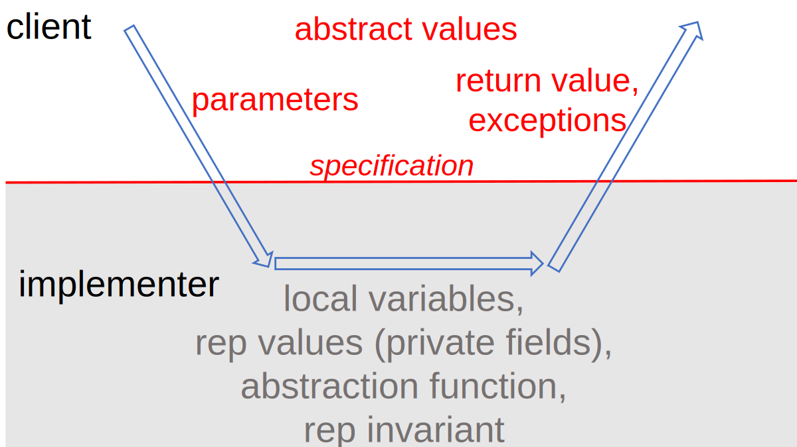

# MIT 6.031 - Software Construction Notes

Our goal is to write code that is:

- **Safe from bugs**. Correctness (correct behavior right now) and defensiveness (correct behavior in the future) are required in any software we build.

- **Easy to understand**. The code has to communicate to future programmers who need to understand it and make changes in it (fixing bugs or adding new features). That future programmer might be you, months or years from now. You’ll be surprised how much you forget if you don’t write it down, and how much it helps your own future self to have a good design.

- **Ready for change**. Software always changes. Some designs make it easy to make changes; others require throwing away and rewriting a lot of code.

## Table of Contents

- [01: Static Checking](#static-checking)
- [02: Basic Java](#basic-java)
- [03: Testing](#testing)
- [04: Code Review](#code-review)
- [05: Version Control](#version-control)
- [06: Specifications](#specifications)
- [07: Designing Specifications](#designing-specifications)
- [08: Mutability & Immutability](#mutability--immutability)
- [09: Avoiding Debugging](#avoiding-debugging)
- [10: Abstract Data Types](#abstract-data-types)
- [11: Abstraction Functions & Rep Invariants](#abstraction-functions--rep-invariants)

## Static Checking

- 90% of programming languages shares similar semantics, which creates a smooth transition to go from language X to language Y.

- A type is a set of values, along with operations that can be performed on those values, and Java has two types:

1. Primitive types: int, short, long, float, double, char, boolean

2. Object types: String, BigInteger, Integer (wrapper class), and any other instance of a class (e.g. object)

- Overloading vs. Overriding:

  * Overloading: defining multiple methods in a class with the same name but different pareamter type.

    ```java
    static double add(double x, double y)

    static int add(int x, int y)
    ```

  * Overriding: redefining a method in a `subclass` that already exists in a `superclass`

- Statically-typed languages vs. Dynamically-typed languages: long story short, don't build on assumptions, static types are more expressive.

- `the use of static types is essential to building and maintaining a large software system.`

- Static checking: the bug is found automatically before the program even runs (at compile time).

- Dynamic checking: the bug is found automatically when the code is executed (at run time).

- If you really want to learn about how computers deal with numbers, you need to take a copmuter systems course, a great one is [CMU:ICS2015](https://www.cs.cmu.edu/afs/cs/academic/class/15213-f15/www/)

- Access modifiers (visibility modifiers) in java works as a namespace in C/C++ lingo, which are:

    1. Public: visible inside and outside its package
    2. protected: visible inside its package and to the sublasses of this class
    3. defalut (no modifier, package-private): visible inside its package only
    4. private: visible inside the class only

The visibiliy degree is ordered highest to lowest.

- Human memory is a bad place to story stuff, so write everything important down in a `comment`, don't worry, it's free of charge.

```java
// inline comment

/*
multiple-line comment
*/

/**
 * Documentation comment
 * @param
 * @return
 * @throw
*/
```

- Programs have to be written with two goals in mind:

  * communicating with the computer. First persuading the compiler that your program is sensible – syntactically correct and type-correct. Then getting the logic right so that it gives the right results at runtime.

  * communicating with other people. Making the program easy to understand, so that when somebody has to fix it, improve it, or adapt it in the future, they can do so.

- Engineering:

  * write a little bit at a time, testing as you go.
  * document the assumptions that your code depends on
  * defend your code against stupidity – especially your own! Static checking helps with that.

## Basic Java

- `String` is an example of an *immutable* type, a type whose values can never change once they have been created.

```java
String s = "a";
s = s + "b";
```


Here when you assign a new value for the String `s` you actually reassign a different reference (the reference to `a` is no longer accessable)

- StringBuilder (another built-in Java class) is a *mutable* object that represents a string of characters, and it has methods that change the value of the object:

```java
StringBuilder sb = new StringBuilder("a");
sb.append("b");
```


- If you want to make a variabel *unreassignable* use the `final` keyword

- Note that we can have an unreassignable reference to a mutable value whose value can change even though we’re pointing to the same object:

```java
final StringBuilder sb = new StringBuilder("a");
sb.append("b");
```

- Equality:
  * `==` does the two variables hold the same value (primitives) or hold the same reference (opjects)
  * `.equals()` are the two objects equal (content context)

- The following code will produce `java.lang.UnsupportedOperationException` because `List.of()` produces an immutable list.

```java
List<String> firstNames = List.of("Huey", "Dewey", "Louie");
firstNames.add("Hissy");
```

## Testing

- Testing is an example of a more general process called *validation*.

- Why validation? The purpose of validation is to uncover problems in a program and thereby increase your confidence in the program’s correctness.

- I think the correctness of software is important in areas where code is doing something vital, like the software of a radiation machine that gives radiation treatment for a cancer patient, you can't risk your software being wrong in such a place. Check the [Therac-25 bug](https://en.wikipedia.org/wiki/Therac-25)

- We can measure the rate of bugs! *defects/kloc* (thousand lines of source code)

- Some terms:
  * A *module* is a part of a software system that can be designed, implemented, tested, and reasoned about separately from the rest of the system.
  * A *specification* (or spec) describes the behavior of a module.
  * A module has an *implementation* that provides its behavior, and clients that use the module.
  * A *test case* is a particular choice of inputs, along with the expected output behavior required by the specification.
  * A *test suite* is a set of test cases for a module.

- `Test-first programming` workflow:
  1. *Spec*: Write a specification for the function.
  2. *Test*: Write tests that exercise the specification.
  3. *Implement*: Write the implementation.

- Software testing is hard, so we will test *systematically*, with goal of desinging a test suit that it's:
  * **Correct**. A correct test suite is a legal client of the specification, and it accepts all legal implementations of the spec without complaint. 
  * **Thorough**. A thorough test suite finds actual bugs in the implementation, caused by mistakes that programmers are likely to make.
  * **Small**. A small test suite, with few test cases, is faster to write in the first place, and easier to update if the specification evolves. Small test suites are also faster to run. You will be able to run your tests more frequently if your test suites are small and fast.

- When creating a test suit want it to cover the possible input space by creating a subdomains that covers this space, for example the `abs()` method in java `Math` library, the possible input space is (a >= 0, a < 0) where in first case `abs()` should return the same input, while in the second it should negate it.

- Look out for boundaries values

- Black box testing: choosing test cases from the spicification only

- Glass box testing: choosing test cases with knowledge of how the function is actually implemented. For example, if the implementation selects different algorithms depending on the input, then you should partition around the points where different algorithms are chosen. If the implementation keeps an internal cache that remembers the answers to previous inputs, then you should test repeated inputs.

- Testing a module of a program in isolation is *unit testing*, while testing a combination of modules or the whole program is *integration testing*

- Running the tests frequently while you’re changing the code prevents your program from regressing — introducing other bugs when you fix new bugs or add new features. Running all your tests after every change is called *regression testing*.

- Software engineering is not linear, it's cyclic:
  1. Write a specification for the function.
  2. Write tests that exercise the spec. As you find problems, iterate on the spec and the tests.
  3. Write an implementation. As you find problems, iterate on the spec, the tests, and the implementation.

## Code Review

- *Code review* is careful, systematic study of source code by people who are not the original author of the code. It’s analogous to proofreading a paper.

- Aim to imporve the code && improve the programmer

- As a self learner I will try to match the criteria they denoted [here](https://web.mit.edu/6.031/www/sp21/general/code-review.html) in my problem sets solutions. I will appreciate any code reviews for my code, you can find the code for the problem sets and the final project on my [github repo](https://github.com/HsHs-dev/MIT-Software-Construction-6.031)

- DRY (Don't Repeat Yourself) makes your program more elastic for changes, that you write a functinality in one place and use it all over the program, if you have to change it, you change it in one place only.

- Comments are double-edged sword, write comments in places that can use some clarification, taking into consideration that the important assumptions are already covered in your [specification](#specifications)

- If you are doing some graphics programming, and you use circles, don't write this number in every calculation place `3.14159265359` put it in a constant `pi` and use it.

```java
public static final double PI = 3.141592653589793;
```

actually don't declare your own pi, use `Math.PI`, but just don't throw *magic numbers*, put them in variables, there are plenty and they are free!

- Parameters are for passing variables, not to be processed inside the method. *Method parameters, in particular, should generally be left unmodified. (This is important for being ready-for-change — in the future, some other part of the method may want to know what the original parameters of the method were, so you shouldn’t blow them away while you’re computing.) It’s a good idea to use final for method parameters*

- x, y, z, are alphabet, not variables names, use expressive names

- Global constans are good. [Global variables are bad](http://wiki.c2.com/?GlobalVariablesAreBad)

- Don't print inside methods, return the result then do whatever you want with it. *only the highest-level parts of a program should interact with the human user or the console.*

- **Actively resist the temptation to handle special cases separately**. If you find yourself writing an if statement for a special case, stop what you’re doing, and instead think harder about the general-case code, either to confirm that it can actually already handle the special case you’re worrying about (which is often true!), or put in a little more effort to make it handle the special case.

## Version Control

The [Version Control reading](https://web.mit.edu/6.031/www/sp21/classes/05-version-control/) is really well written about version control.

For extra reading and practicing:
  * [Pro Git book](https://git-scm.com/book/en/v2) is your `git` reference

  * [Lab8: Version Control (git) and Backups](https://decal.ocf.berkeley.edu/#week-8-4012025) from UCB Sysadmin Decal course
  * [Version Control (Git)](https://missing.csail.mit.edu/2020/version-control/) from MIT The Missing Semester of Your CS Education

## Specifications

- A specification of a method has several parts:
  * a method signature, giving the name, parameter types, return type, and exceptions thrown
  * a requires clause, describing additional restrictions on the parameters
  * an effects clause, describing the return value, exceptions, and other effects of the method



Taken together, the form the *precondition* and *postcondition* of the method



- Java specification:

```java
static int find(int[] arr, int val)
requires:
val occurs exactly once in arr
effects:
returns index i such that arr[i] = val
```

```java
/**
 * Find a value in an array.
 * @param arr array to search, requires that val occurs exactly once
 *            in arr
 * @param val value to search for
 * @return index i such that arr[i] = val
 */
static int find(int[] arr, int val)
```



- `null` is not good

> Careless use of `null` can cause a staggering variety of bugs. Studying the Google code base, we found that something like 95% of collections weren’t supposed to have any `null` values in them, and having those **fail fast** rather than silently accept `null` would have been helpful to developers.

> Additionally, `null` is unpleasantly ambiguous. It’s rarely obvious what a `null` return value is supposed to mean — for example, `Map.get(key)` can return `null` either because the value in the map is `null`, or the value is not in the map. Null can mean failure, can mean success, can mean almost anything. Using something other than `null` makes your meaning clear.

- Document *checked excpetion* in your spec `@throws` and method signature by `throws`, add *undchecked exception* to the spec `@throws`, *errors* shouldn't be documented

## Designing Specifications

three dimensions for comparing specs:

- How deterministic it is. Does the spec define only a single possible output for a given input, or does it allow the implementor to choose from a set of legal outputs?

Deterministic vs. Underdetermined

- How declarative it is. Does the spec just characterize what the output should be, or does it explicitly say how to compute the output?

Declarative vs. Operational

- How strong it is. Does the spec have a small set of legal implementations, or a large set?

A specification S2 is stronger than a specification S1 if the set of implementations that satisfy S2 is a strict subset of those that match S1.

making a specification stronger means shrinking the set of implementations that satisfy it.

To decide whether one specification is stronger or weaker than another, we compare the strengths of their preconditions and postconditions. A precondition is a predicate over the state of the input, so making a precondition stronger means shrinking the set of legal inputs. Similarly, a postcondition is a predicate over the state of the output, so a stronger postcondition shrinks the set of allowed outputs and effects.

We can make a specification stronger by weakining its precondition. Not fully understanding this but after thinking about it for a while I think that's because we are broadining it's input spectrum, which is benficial for both client and implementer.

Implementer: I don't have to worry about certain use cases.

Client: I can use this for a variety of my work.

## Mutability & Immutability

The class reading is pretty straight forward, aliasing is the problem, when two constructs in the program points to the same object and one of them modifies something without the other's knowing, this causes nasty problems.

An elegant solution to the `remove()` problem that we encountered using the iterator, is that Java throws `Concurrent­Modification­Exception`, and this is done through an internal Java field called [modCount](https://docs.oracle.com/javase/8/docs/api/java/util/AbstractList.html#modCount) which keeps track of the state of an Iterator, if something that is modified through it, not using it's own `remove()` method.

Appreciation to the Java language writers that writes a **fail-fast code!**

This reading really emphasize the importance of this course, that writing code is indeed engineering.

## Avoiding Debugging

- The best way to deal with debugging is avoiding debugging at all, by writing you code in a way that is *bug safe*

- *Static checking* and *dynamic checking* helps to identify bugs in compile time and runtime respectively

- As we saw in [Immutability](#mutability--immutability) `Strings` are great in passing information form one place in the program to the other without worrying about changing its value.

- It's a good practice to use the `final` keyword for method parameters and as many local variables as possible.

- The early you catch the bug, the better your code is *(fail faster)*

- Another good practice to limit bugs, as we saw in [testing](#testing), is *incremental development*, build a little and test often

- Limit the scope of your variables, so you narrow down the searching scope for the bug

## Abstract Data Types

- Hide the implementation details and only give an interface to make operations on

- Operation matters, not representation

- Types (whether built-in or user-defined) are classified based on their mutaibility

- The operations of an abstract type are classified as follows:
  * `Creators` create new objects of the type. A creator may take values of other types as arguments, but not an object of the type being constructed.
  * `Producers` also create new objects of the type, but require one or more existing objects of the type as input. The `concat` method of String, for example, is a producer: it takes two strings and produces a new string representing their concatenation.
  * `Observers`
   take objects of the abstract type and return objects of a different type. The `size` method of `List`, for example, returns an `int`.
  * `Mutators` change objects. The `add` method of `List`, for example, mutates a list by adding an element to the end.



- Designing an abstract type involves choosing good operations and determining how they should behave. Here are a few rules of thumb:
  * Better to have **few**, **simple** operations that can be combined in powerfull ways
  * Each operation should have a well-defined purpose and a **coherent** behavior
  * The set of operations should be **adequate** in the sense that there must be enough to do the kinds of computations clients are likely to want to do, test this by checking that every property of an object can be extracted
  * Do not **mix generic and domain-specific** features

- A good abstract data type should be **representation independent**. This means that the use of an abstract type is independent of its representation (the actual data structure or data fields used to implement it), so that changes in representation have no effect on code outside the abstract type itself.

- The specification of an ADT includes the *name of the class*, the *Javadoc comment* just before the class, and *the specifications of its public methods and fields*. These are the contract that is visible to the client of the class.

- The representation of an ADT consists of its fields and any assumptions or requirements about those fields.

- The implementation of an ADT consists of the method implementations that manipulate its representation.

## Abstraction Functions & Rep Invariants

- Another property, and most important, that makes a good ADT is that it **preserves its own invariants**

- What is an [invariant](https://en.wikipedia.org/wiki/Invariant_(mathematics))? An invariant is a property of a program that is always true, for every possible runtime state of the program.

- Avoid *representation exposure* that may broke your internal invariant, that can be achieved through **definsive copying**

- **rep exposure safety argument**, this is a comment that examines each part of the rep, looks at the code that handles that part of the rep (particularly with respect to parameters and return values from clients, because that is where rep exposure occurs), and presents a reason why the code doesn’t expose the rep.

- Update to what a specification may talk about:



- A well designed ADT can enforce properties that we otherwise would have to state as preconditins

- To make an invariant hold, we need to:
  * make the invariant true in the initial state of the object; and
  * ensure that all changes to the object keep the invariant true.

- In terms of ADT this would be translated to:
  * creators and producers must establish the invariant for new object instances; and
  * mutators, observers, and producers must preserve the invariant for existing object instances.

- The invariant of and ADT is true if:
  1. established by creators and producers;
  2. preserved by mutators, observers, and producers; and
  3. no representation exposure occurs
